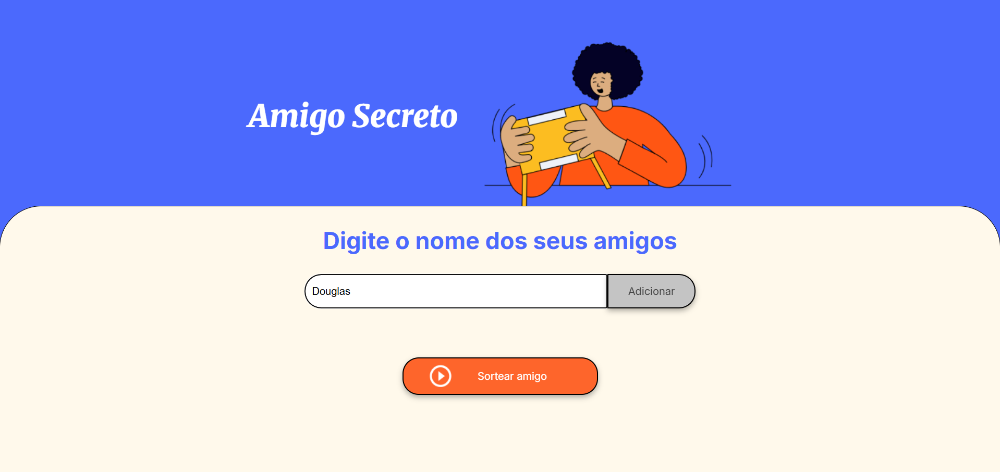
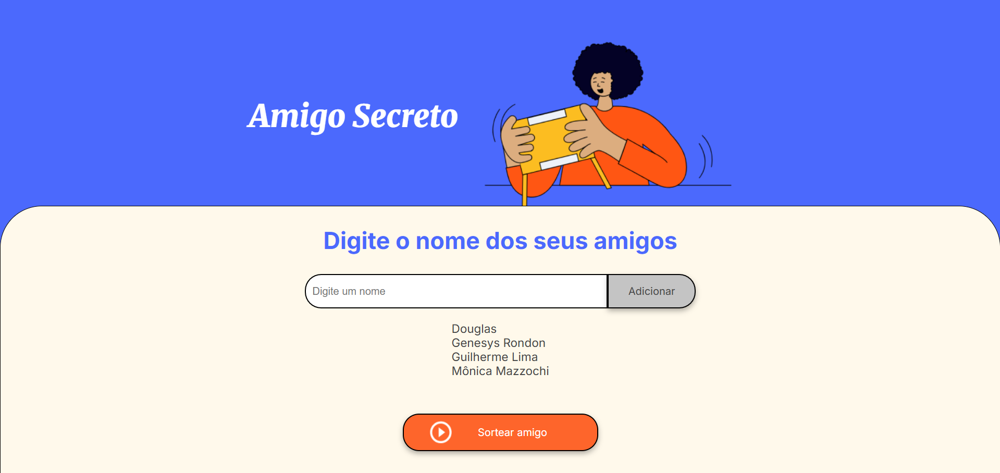
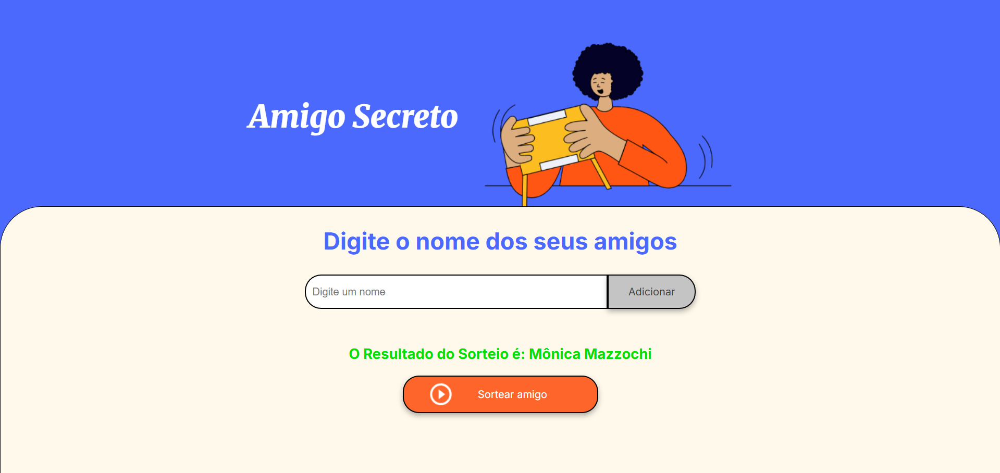

# ONE: Desafio do Amigo Secreto

## Descrição

Este repositório contém um projeto de **Amigo Secreto** proposto pelo **Programa Oracle Next Education** e desenvolvido apenas com HTML, CSS e JavaScript. O objetivo é criar uma aplicação simples, executável no navegador, que permita cadastrar participantes e realizar o sorteio deles, respeitando regras básicas e exibir os resultados de forma segura.

O foco do desafio é boa organização do código front-end, experiência do usuário e lógica do sorteio sem recorrer a frameworks ou back-end.

---

## Objetivos do desafio

* Criar uma interface para cadastrar participantes.
* Sortear os amigos cadastrados no sistema.
* Manter projeto acessível e responsivo.

---

## Tecnologias

* HTML5
* CSS3 (puro)
* JavaScript (ES6+, sem bibliotecas externas)

---

## Estrutura de pastas do projeto

```
/Desafio-Amigo-Secreto-ONE/
└─ /assets/
   └─ (imagens)
├─ LICENSE
├─ README.md
├─ app.js
├─ index.html
├─ styles.css

```

---

## Como executar

1. Clone ou baixe o repositório.
2. Abra o arquivo `index.html` em um navegador moderno (Chrome, Firefox, Edge, Safari).

> Não há servidor ou dependências — basta abrir no navegador.

---

## Interface e UX
### Interface Inicial

Essa é a interface inicial do desafio. Clique o no campo de texto para adicionar os amigos para o sorteio.

### Adicionar Amigos

Após digitar o nome do primeiro amigo clique em "Adicionar". Repita esse processo para todso os amigos que participarão do sorteio de amigo secreto.

### Começar o Sorteio

Para iniciar o sorteio clique em "Sortear amigo".

### Sorteio

Cada vez que clicar em "Sortear amigo" ocorrerá um novo sorteio do amigo secreto.

---

## Licença
Este projeto está sob a licença MIT. Consulte o arquivo LICENSE para mais informações.
